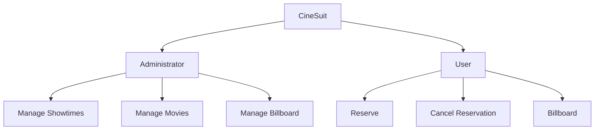

# CineSuit 🌏🌐

## Table of Contents
| Index | Title  |
|--|--|
| 1. | [Description](#Description) |
| 2. | [Features](#Features) |
| 3. | [Technologies Used](#Technologies) |
| 4. | [Repository Usage](#Usage) |
| 5. | [Execution Instructions](#Instructions) |
| 6. | [Map](#Map) |
| 7. | [Authors](#Authors) |

## Description🚀

The CineSuit project consists of a cinema application under development. It is designed to allow the addition of movies, manage showtimes, and enable users to reserve or cancel seats for their desired showtimes.

## Features🧮

1. **Admin** 👥: Allows registering and managing everything needed for cinema functionalities.

2. **User** 🌐: Enables access to movies and the billboard to make or cancel reservations.

## Technologies🖥️

- **Python** 🐍: The entire application is built with Python.

## Instructions📐

1. Clone the repository to your local machine.  
2. Properly configure all the necessary Python settings.  
3. Run the project from the terminal.

## Map 

## Autors👤

[Leonardo Gonzalez](https://github.com/DLeonardoG)

[Laura Rodríguez](https://github.com/laura2ndrea)

[Michelle Sánchez](https://github.com/miDaya02)

[Mariana Rueda](https://github.com/mariana34r)

[Juan Esteban Alfonso](https://github.com/juanalfonsocampus)
