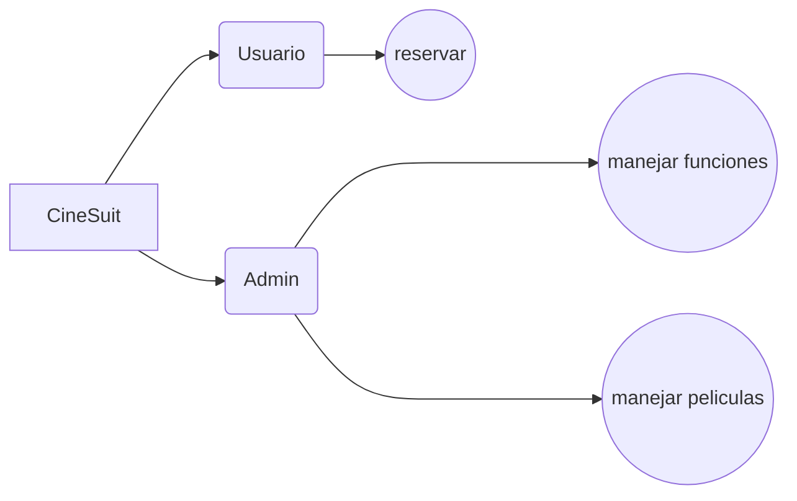

# CineSuit 🌏🌐

## Tabla de contenido
| Indice | Título  |
|--|--|
| 1. | [Descripción](#Descripcion) |
| 2. | [Características](#Caracteristicas) |
| 3. | [Tecnologías Utilizadas](#Tecnologias) |
| 4. | [Uso del Repositorio](#Uso) |
| 5. | [Instrucciones de Ejecución](#Instrucciones) |
| 6. | [Mapa](#Mapa) |
| 7. | [Autores](#Autores) |

## Descripcion🚀

El proyecto CineSuit consiste en un aplicativo de un cine en desarrollo que se desea un aplicativo que le permita añadir sus peliculas, sus funciones a su vez que le permite a los usuarios reservar sus asientos en las funciones deseadas.

## Caracteristicas🧮

1. **Admin** 👥: Permite registrar y añadir todo lo necesario que se necesita en la funcionalidad de cine

2. **Usuario** 🌐: Permite acceder a las peliculas y a la cartelera para realizar la reserva o cancelar la reserva

## Tecnologias🖥️

- **Python** 🐍: Todas la aplicacion esta hecha con python.

## Instrucciones📐

1. Clona el repositorio a tu máquina local. 
2. Configura adecuadamente todo lo adecuado drespecto a python.
3. Ejecuta el proyecto desde la terminal.

## Mapa 

## Autores👤

[Leonardo Gonzalez](https://github.com/DLeonardoG)

Michelle Sánchez

Laura Rodríguez

Mariana Rueda

Juan Esteban Alfonso
